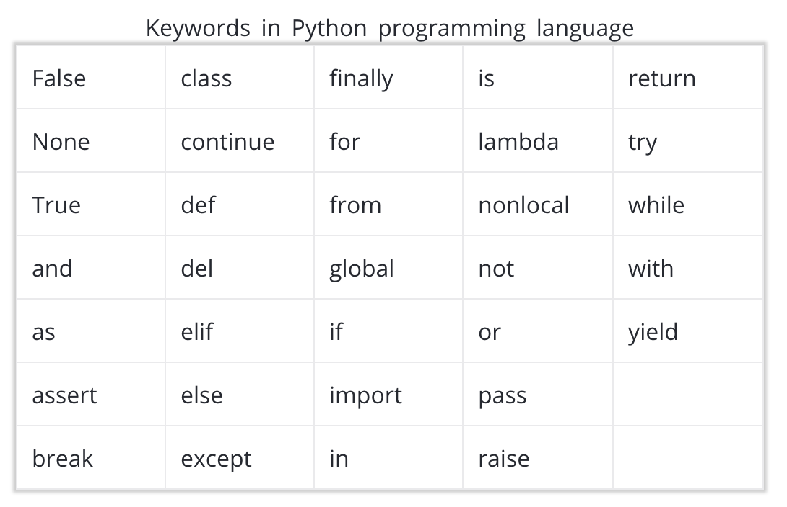
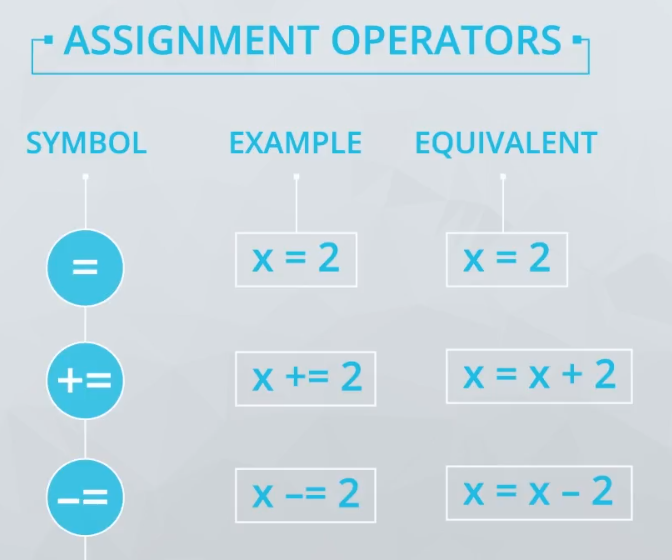

# Data Types and Operators

- [Data Types and Operators](#data-types-and-operators)
  - [L2.1 Introduction](#l21-introduction)
    - [print()](#print)
  - [L2.2 Arithmetic Operators](#l22-arithmetic-operators)
  - [L2.5 Variables and Assignment Operators](#l25-variables-and-assignment-operators)
    - [Variable Naming Scheme](#variable-naming-scheme)
    - [Assignment Operators](#assignment-operators)
  - [L2.6 Quiz: Variables and Assignment Operators](#l26-quiz-variables-and-assignment-operators)
    - [Scientific Notation](#scientific-notation)
  - [L2.8 Integers and Floats](#l28-integers-and-floats)
    - [Integers and Floats](#integers-and-floats)
    - [type()](#type)
    - [Python Best Practices](#python-best-practices)
    - [PEP8](#pep8)
  - [L2.9 Quiz: Integers and Floats](#l29-quiz-integers-and-floats)
    - [Divide by Zero](#divide-by-zero)
    - [Two Types of Error](#two-types-of-error)
  - [L2.10 Booleans, Comparison Operators, and Logical Operators](#l210-booleans-comparison-operators-and-logical-operators)
    - [Comparison Operators](#comparison-operators)
    - [Logical Operators](#logical-operators)
  - [L2.13 Strings](#l213-strings)
    - [len()](#len)
  - [L2.14 Quiz: Strings](#l214-quiz-strings)
  - [L2.16 Type and Type Conversion](#l216-type-and-type-conversion)
  - [L2.17 Quiz: Type and Type Conversion](#l217-quiz-type-and-type-conversion)
  - [L2.19 String Methods](#l219-string-methods)
  - [L2.20 String Methods](#l220-string-methods)
    - [doc](#doc)
      - [`str.format()`](#strformat)
  - [L2.21 Another String Method - Split](#l221-another-string-method---split)
    - [doc](#doc-1)
      - [`str.split()`](#strsplit)
  - [L2.22 Quiz: String Methods Practice](#l222-quiz-string-methods-practice)
    - [doc](#doc-2)
      - [`str.find()`](#strfind)
      - [`str.rfind()`](#strrfind)
      - [`str.count()`](#strcount)
  - [2.24 "There's a Bug in my Code"](#224-%22theres-a-bug-in-my-code%22)
    - [Successful Debugging Method](#successful-debugging-method)
      - [Understanding Common Error Messages](#understanding-common-error-messages)
      - [Search for Your Error Message](#search-for-your-error-message)
  - [L2.26 Summary](#l226-summary)
    - [What's Next?](#whats-next)
  - [Vocabulary](#vocabulary)
  - [Further Reading](#further-reading)

## L2.1 Introduction

### print()

- `print()` is a useful built-in function in Python that we can use to display our results.

    

- Even though there's a space between `print` and `(`, it can still be interpreted. But we're **not recommend** this approach.

    ```py
    print(1+1) # 2
    print (1+1) # 2
    ```

## L2.2 Arithmetic Operators


- `+` : Addition
- `-` : Subtraction
- `*` : Multiplication

---

- `/` : Division

    ```py
    print(7 / 2) # 3.5
    print(-7 / 2) # -3.5

    print(7/3) # 2.3333333333333335
    print(-7/3) # -2.3333333333333335

    print(8 / 3) # 2.6666666666666665
    print(-8 / 3) # -2.6666666666666665
    ```

- `//` : **Integer** Division, divides and rounds down（無條件捨去） to the nearest integer

    ```py
    print(7 // 2) # 3
    print(-7 // 2) # 4

    print(7 // 3) # 2
    print(-7 // 3) # -3

    print(8 // 3) # 2
    print(-8 // 3) # -3
    ```

---

- `%` : Mod (the remainder after dividing)

    ```py
    print(9 % 2) # 1
    ```

- `**` : Exponentiation

    ```py
    print(3 ** 2) # 9
    ```

- note that `^` do **bitwise XOR** operation, as you might have seen in other languages)

    

## L2.5 Variables and Assignment Operators

- we can assign multiple variables at once

    ```py
    # x = 2
    # y = 3
    # z = 5
    x, y, z = 2, 3, 5
    ```

- add meaningful variable name, to improve readability

    ```py
    population = 1000
    area = 10
    density = population / area
    print(density) # 100
    ```

### Variable Naming Scheme


- only use ordinary letters, numbers or underscores
- can't have spaces
- need to start with a letter or underscore




- can't use [reserved words](https://pentangle.net/python/handbook/node52.html) or build-in identifiers


- **snake case**: use all lowercase letters and underscores to separate words

### Assignment Operators



## L2.6 Quiz: Variables and Assignment Operators

### Scientific Notation

- all three numbers below are equal, the type of scientific notation is **float**

```py
4.445e8         # 444500000.0
4.445 * 10 ** 8 # 444500000.0
444500000.0     # 444500000.0
```

- Q3: Here is a [list of U.S. states in order of the date they entered the Union](https://www.wikiwand.com/en/List_of_U.S._states_by_date_of_admission_to_the_Union). Say you wanted to create a variable for Delaware and assign it a value to signify that it joined the Union first. Which of the following are valid variable names and assignments in Python?

    | answer | option       | reason                                                     |
    | ------ | ------------ | ---------------------------------------------------------- |
    |        | del = 1      | `del` is a reserved word                                   |
    | (O)    | delaware = 1 |
    |        | 1 de = first | can't have space, should start with a letter or underscore |
    | (O)    | de = 1       |

## L2.8 Integers and Floats

### Integers and Floats

- In python, every object we encounter will have a type
  - int for integer values
  - float for decimal or floating point values

    ```py
    print(3 / 4) # 0.75 is float
    print(16 / 4) # 4.0 is still float
    ```

### type()

- `type()`: built-in function that returns the type of an object.

    

- if we add `.` after a whole number, that type will be `float`

    ```py
    type(387) # int
    type(387.) # float
    ```

---

- a operation involving an int and float always produces a float

    ```py
    print(3 + 2.5) # 5.5
    ```

- we can use `int()` to manually convert type, it will cut the number after decimal point (**not round off**)

    ```py
    int(49.7) # 49
    int(-49.7) # -49
    ```

- using `float()` convert int to float adds decimal zeros to the end of the number

    ```py
    float(3520 + 3239) # 6759.0
    ```


- floating numbers are approximations
- this tradeoff can sometimes have surprising results

    ```py
    print(0.1 + 0.1 + 0.1) # 0.30000000000000004
    ```

### Python Best Practices

- when calling a function, put opening parentheses after the name of the function

    ```py
    print(8)    # O
    print (8)   # X
    ```

- don't put extra spaces immediately inside the parentheses either

    ```py
    print(3 * 7)    # O
    print( 3 * 7 )  # X
    ```

- mixing operators with different priorities (like multiplication and subtraction), **add space around the lower priority**

    ```py
    print(3*7 - 1)      # O
    print(3 * 7 - 1)    # X
    ```


- don't write extremely long lines of code, people commonly limit lines that are 79 or 99 characters long
- if we have to write longer lines, consider rewriting, simplifying, or separating code into multiple lines

### PEP8

- [Python Developer's Guide](https://www.python.org/dev/peps/pep-0008/)
- purpose:
  - clarity, make code easier to read
  - consistency

## L2.9 Quiz: Integers and Floats

### Divide by Zero

```py
print(5/0)

'''
Traceback (most recent call last):
  File "/tmp/vmuser_kvvlefczqi/quiz.py", line 1, in <module>
    print(5/0)

ZeroDivisionError: division by zero
'''
```

- Traceback: What was the programming doing when it broke, this part is usually less helpful
- Error message is more helpful

### Two Types of Error

- In general, there are two types of errors to look out for
  - Syntax: problem detected when Python checks the code **before it runs it**
  - Exceptions: problem that occurs **when the code is running**

## L2.10 Booleans, Comparison Operators, and Logical Operators

- it's named for its inventor George Bool
- Boolean: holds one of the values `True`(1) or `False`(0)

    ```py
    the_sun_is_up = True
    the_sun_is_down = False
    ```

### Comparison Operators


### Logical Operators


## L2.13 Strings

- we can define a string with either double quotes `"` or single quotes `'`

    ```py
    print("hello") # double quotes
    print('hello') # single quotes
    ```

- although there're some edge cases, like having quotating mark in our string

    ```py
    pet_halibut = "Why should I be tarred with the epithet "loony" merely because I have a pet halibut"

    # SyntaxError: invalid syntax
    ```

- there're two solutions:
  1. place the string in single quotes rather than double quotes

    ```py
    pet_halibut = 'Why should I be tarred with the epithet "loony" merely because I have a pet halibut'
    ```

  2. use the backslash(`\`) to escape quotes (**recommended**)

    ```py
    salesman = '"I think you\'re an encyclopaedia salesman'"
    ```

- there're few operations that used for int and float that we can also use for strings
  - `+`: combine strings
  - `*`: repeat strings

    ```py
    first_word = "Hello"
    second_word = "There"
    print(first_word + " " + second_word) # Hello There

    word = "Hello"
    print(word * 5) # HelloHelloHelloHelloHello

    print(first_word / second_word) # TypeError: unsupported operand type(s) for /: 'str' and 'str'
    ```

### len()

- `len()` is a built-in function that returns the length of an object

```py
udacity_length = len("Udacity")
print(udacity_length) # 7
```

## L2.14 Quiz: Strings

- Q5: We've just used the `len` function to find the length of strings. What does the `len` function return when we give it the integer 835 instead of a string?

    | answer | option | reason |
    | ------ | ------ | ------ |
    |        | 835    |        |
    |        | 3      |        |
    |        | 2      |        |
    | (O)    | Error  |        |

```py
len(835) # TypeError: object of type 'int' has no len()
```

## L2.16 Type and Type Conversion

- there're specially designed functions for working with each data type
  - e.g. In [L2.14 Quiz: Strings](#l214-quiz-strings), `len(835)` returns an error, because it only accept string as a parameter

## L2.17 Quiz: Type and Type Conversion

- Quiz: Total Sales

In this quiz, you’ll need to change the types of the input and output data in order to get the result you want.

Calculate and print the total sales for the week from the data provided. Print out a string of the form `"This week's total sales: xxx"`, where xxx will be the actual total of all the numbers. You’ll need to change the type of the input data in order to calculate that total.

```py
mon_sales = "121"
tues_sales = "105"
wed_sales = "110"
thurs_sales = "98"
fri_sales = "95"

#TODO: Print a string with this format: This week's total sales: xxx
# You will probably need to write some lines of code before the print statement.

weekly_sales = int(mon_sales) + int(tues_sales) + int(wed_sales) + int(thurs_sales) + int(fri_sales)
weekly_sales = str(weekly_sales) # don't forget convert back to str type
print("This week's total sales: " + weekly_sales)
```

## L2.19 String Methods


- functions are similiar to operators
  - the only difference is how they look

| diff             | operator            | function           |
| ---------------- | ------------------- | ------------------ |
| inputs placement | next to an operator | in the parentheses |
| notation         | descriptive name    | short symbols      |

- there're three techniques for operating a value
  1. operator
  2. function
  3. **method**
- **Method**: a function that **belongs** to an object
  - methods are associated with specific types of objects
  - that is, there are different methods depending on the type of date we're working with

- e.g. `.title()` only work with string type

```py
print("sebastian thrun".title()) # Sebastian Thrun
```

- **Argument(引數)**: the inputs in the parentheses
  - the object is always the first argument to method
  - e.g. `"sebastian thrun"` and `full_name` is the argument of `title()` and `islower` methods.

  ```py
  print("sebatian thrun".title())
  full_name = "sebastian thrun"
  print(full_name.islower())
  ```

## L2.20 String Methods

- `format()` Practice

  Use the coding space below to practice using the format() string method. There are no right or wrong answers here, just practice!

  ```py
  # Write two lines of code below, each assigning a value to a variable

  ncu_students = 1
  ccu_students = 2

  # Now write a print statement using .format() to print out a sentence and the 
  #   values of both of the variables

  print("the student in 中字輩 is {0}".format(ncu_students + ccu_students))
  ```

### doc

#### [`str.format()`](https://docs.python.org/3/library/stdtypes.html#str.format)

## L2.21 Another String Method - Split

- two arguments:
  1. sep: seperator
     - if not specified or `None`, default is blank space
     - it can consists of multiple character
  2. maxsplit: the list will have at most **`maxsplit + 1`** elements
     - if not specified or `-1`, then there's no limit

```py
# if not given, default is blank space
new_str = "The cow jumped over the moon."
new_str.split() # ['The', 'cow', 'jumped', 'over', 'the', 'moon.']

# the list will have at most 3+1 = 4 elements
new_str.split(' ', 3) # ['The', 'cow', 'jumped', 'over the moon.']

# sep
new_str.split(None, 3) # ['The', 'cow', 'jumped', 'over the moon.']

# empty string will still be seperated
'1,,2'.split(',') # ['1', '', '2']

# sep can consists of multiple characters
'1<>2<>3'.split('<>') # ['1', '2', '3']
```

- *tip: `None` is a type called `NoneType`*

### doc

#### [`str.split()`](https://docs.python.org/3/library/stdtypes.html#str.split)

```py
print(type(None)) # <class 'NoneType'>
```

## L2.22 Quiz: String Methods Practice

- print the following question about the verse
  1. What is the length of the string variable verse?
  2. What is the index of the first occurrence of the word 'and' in verse?
  3. What is the index of the last occurrence of the word 'you' in verse?
  4. What is the count of occurrences of the word 'you' in the verse?
- You will need to refer to [Python's string methods documentation](https://docs.python.org/2/library/string.html).

```py
verse = "If you can keep your head when all about you\n  Are losing theirs and blaming it on you,\nIf you can trust yourself when all men doubt you,\n  But make allowance for their doubting too;\nIf you can wait and not be tired by waiting,\n  Or being lied about, don’t deal in lies,\nOr being hated, don’t give way to hating,\n  And yet don’t look too good, nor talk too wise:"
print(verse)

# Use the appropriate functions and methods to answer the questions above
# Bonus: practice using .format() to output your answers in descriptive messages!
message = "the length of the verse is {}, the index of the first occurrence of the word 'and' in verse is{}, the last occurrences of the word 'you' in verse {}, the count of occurrences of the word 'you' in verse is {}"

length = len(verse) # 362
first_idx = verse.find("and") # 65
last_idx = verse.rfind("you") # 186
count = verse.count("you") # 8

print(message.format(length, first_idx, last_idx, count))
```

- tip
  - we can create an empty curly braces(`{}`) at first, then add arguments later inside the format method.

### doc

#### [`str.find()`](https://docs.python.org/3/library/stdtypes.html#str.find)
#### [`str.rfind()`](https://docs.python.org/3/library/stdtypes.html#str.rfind)
#### [`str.count()`](https://docs.python.org/3/library/stdtypes.html#str.count)

## 2.24 "There's a Bug in my Code"

### Successful Debugging Method

1. [Understand common error messages you might receive and what to do about them.](#understanding-common-error-messages)
2. [Search for your error message, using the Web community.](#search-for-your-error-message)
3. Use print statements.

#### Understanding Common Error Messages

- "SyntaxError: unexpected EOF while parsing": often produced when you have accidentally left out something, like a parenthesis.

  ```py
  greeting = "hello"
  print(greeting.upper

  # print(greeting.upper
  #                       ^
  # SyntaxError: unexpected EOF while parsing
  ```

- "TypeError: len() takes exactly one argument (0 given)": not include the required number of arguments when I'm calling a function

  ```py
  chars = "supercalifragilisticexpialidocious"
  len()

  # TypeError: len() takes exactly one argument (0 given)
  ```

#### Search for Your Error Message

- Copy and paste the error message, then search
- search using just key words from the error message
- along with some other helpful words that describe your context, like Python

## L2.26 Summary

### What's Next?

- Data structures: where you organize and group together these data types into different containers.
- two remaining types of operators in Python

## Vocabulary

1. Mathematical Order of Operations (n.) 運算次序
2. round down (n.) 無條件捨去
   - round up (n.) 無條件進入
   - round to (n.) 四捨五入
   - Ref: [【外在動詞】Round - 數字專論 @ Verb Master 動詞達人 :: 痞客邦 ::](https://pc856555.pixnet.net/blog/post/24578632)
3. whole number (n.) 整數
4. runoff (n.) 流走的東西
5. arid (adj.) 乾旱的
6. fishy (adj.) 可疑的
7. underpin (v.) 為(論據、主張等)打下基礎
8. look out for (ph.) 注意、留神
9. edge case (n.) 邊界情況
10. punctuation (n.) 標點符號
11. encyclopaedia (n.) 百科全書
12. disguise (v.) 偽裝

<!-- ## Reference

1.  -->

## Further Reading

1. [Rounding Methods](https://www.mathsisfun.com/numbers/rounding-methods.html)
2. [PEP 8 -- Style Guide for Python Code | Python.org](https://www.python.org/dev/peps/pep-0008/)
3. [Built-in Types — Python 3.8.2rc2 documentation](https://docs.python.org/3/library/stdtypes.html#string-methods)
4. [如何使用 Python 進行字串格式化](https://blog.techbridge.cc/2019/05/03/how-to-use-python-string-format-method/)
