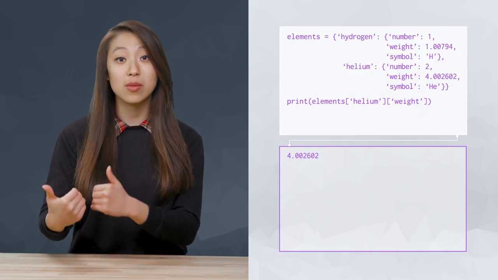

# Data Structure

<details><summary>Outline</summary>

<Dropdown Content>

- [Data Structure](#data-structure)
  - [L3.1 Introduction](#l31-introduction)
    - [Primitive Data Types](#primitive-data-types)
    - [Data Structure](#data-structure-1)
    - [(last two types of) operators](#last-two-types-of-operators)
  - [L3.2 Lists and Membership Operators](#l32-lists-and-membership-operators)
    - [List](#list)
      - [zero-based indexing](#zero-based-indexing)
      - [Slice and Dice with Lists](#slice-and-dice-with-lists)
    - [Membership Operators](#membership-operators)
    - [Mutability and Order](#mutability-and-order)
      - [Strings vs. Lists](#strings-vs-lists)
      - [Mutability](#mutability)
      - [Order](#order)
      - [Conclusion](#conclusion)
  - [L3.3 Quiz: Lists and Membership Operators](#l33-quiz-lists-and-membership-operators)
    - [Quiz: Slicing Lists](#quiz-slicing-lists)
  - [L3.6 List Methods](#l36-list-methods)
    - [String: Call by Value](#string-call-by-value)
    - [List: Call by Reference](#list-call-by-reference)
    - [List Methods](#list-methods)
  - [L3.8 Check for Understanding: Lists](#l38-check-for-understanding-lists)
  - [L3.9 Tuples](#l39-tuples)
    - [Tuple Support Indexing and Slicing](#tuple-support-indexing-and-slicing)
    - [Tuple Unpacking](#tuple-unpacking)
  - [L3.10 Quiz: Tuples](#l310-quiz-tuples)
  - [L3.11 Sets](#l311-sets)
  - [L3.13 Dictionaries and Identity Operators](#l313-dictionaries-and-identity-operators)
    - [Dictionary](#dictionary)
    - [Identity Operators](#identity-operators)
  - [L3.14 Quiz: Dictionaries and Identity Operators](#l314-quiz-dictionaries-and-identity-operators)
    - [`get` with a Default Value](#get-with-a-default-value)
    - [Checking for Equality vs. Identity: `==` vs. `is`](#checking-for-equality-vs-identity--vs-is)
  - [L3-18. Check for Understanding: Data Structures](#l3-18-check-for-understanding-data-structures)
  - [L3-19. Compound Data Structures](#l3-19-compound-data-structures)
  - [L3-20. Quiz: Compound Data Structures](#l3-20-quiz-compound-data-structures)
  - [L3-22. Practice Questions](#l3-22-practice-questions)
  - [L3-24. Conclusion](#l3-24-conclusion)
  - [Vocabulary](#vocabulary)

</details>

---

## L3.1 Introduction

### Primitive Data Types

1. int
2. float
3. boolean
4. string

### Data Structure

- group and order these data types

1. list
2. tuple
3. set
4. dictionary
5. compound data structure

### (last two types of) operators

1. membership
2. identity

## L3.2 Lists and Membership Operators

- Data Structure: containers that organize and group data types, which contain other data types and even other containers

### List

- a data type for **mutable ordered** sequences of elements

#### zero-based indexing

- index start from 0
- how far the element is from the beginning of the list
- the last element index is -1

```py
months = ['January', 'February', 'March', 'April', 'May', 'June', 'July', 'August', 'September', 'October', 'November', 'December']

print(months[0]) # January
print(months[1]) # February
print(months[7]) # August

print(months[-1]) # December
print(months[-0]) # January

print(months[25]) # IndexError: list index out of range
```

- lists can contain any mix and match of the data types

```py
list_of_random_things = [1, 3,4, 'a string', True]
```

#### Slice and Dice with Lists

- slicing: using indices to slice off parts of an object
  - lower bound is inclusive; upper bound is **exclusive**

```py
months = ['January', 'February', 'March', 'April', 'May', 'June', 'July', 'August', 'September', 'October', 'November', 'December']

q3 = month[6:9] # ['July', 'August', 'September']

first_half = month[:6] # ['January', 'February', 'March', 'April', 'May', 'June']
second_half = month[6:] # ['July', 'August', 'September', 'October', 'November', 'December']
```

- lists are most similar to strings
  - both types support `len` function, indexing, and slicing
- `len(str)` contains empty spaces

```py
greeting = "Hello there"
months = ['January', 'February', 'March', 'April', 'May', 'June', 'July', 'August', 'September', 'October', 'November', 'December']

print(len(greeting), len(months)) # 11 12
print(greeting[6:9], months[6:9]) # 'the' ['July', 'August', 'September']
```

### Membership Operators


- `in`: evaluates if object on left side is included in object on right side
- `not in`: evaluates if object on left side is not included in object on right side
- support both string and list type

```py
greeting = "Hello there"
print('her' in greeting, 'her' not in greeting)
# True False

months = ['January', 'February', 'March', 'April', 'May', 'June', 'July', 'August', 'September', 'October', 'November', 'December']
print('Sunday' in months, 'Sunday' not in months)
# False True
```

### Mutability and Order

#### Strings vs. Lists

| Features         | Strings              | Lists               |
| ---------------- | -------------------- | ------------------- |
| Support indexing | O                    | O                   |
| Support slicing  | O                    | O                   |
| Support `len()`  | O                    | O                   |
| Elements         | sequences of letters | any type of objects |
| Mutability       | X                    | O                   |
| Order            | O                    | O                   |

#### Mutability


- whether an object can be modified after it has been created
- lists are mutable, strings are immutable
  - 
  - 
- immutable can also be called **hashable**
  - ref: [python - Hashable, immutable - Stack Overflow](https://stackoverflow.com/questions/2671376/hashable-immutable)

#### Order


- whether the order of elements in an object matters
- and whether this can be used to access elements
- both lists and strings are ordered

#### Conclusion


- Data type selection is largely dependent on properties, and what you can easily do with it!

## L3.3 Quiz: Lists and Membership Operators

### Quiz: Slicing Lists

- Select the three most recent dates from this list using list slicing notation. Hint: negative indexes work in slices!

```py
eclipse_dates = ['June 21, 2001', 'December 4, 2002', 'November 23, 2003',
                 'March 29, 2006', 'August 1, 2008', 'July 22, 2009',
                 'July 11, 2010', 'November 13, 2012', 'March 20, 2015',
                 'March 9, 2016']

# TODO: Modify this line so it prints the last three elements of the list
print(eclipse_dates[:-3]) # X
print(eclipse_dates[-3:]) # O, start from index of -3
```

## L3.6 List Methods

### String: Call by Value

- due to string is immutable, so it's call by value

```py
name = "Jim"
student = name
name = "Tim"

print(name)     # Tim
print(student)  # Jim
```

### List: Call by Reference

- due to list is mutable, so it's call by reference
- 

### List Methods

- `len()`: how many elements in the list
- `max()`: greatest elements in the list
  - the maximum elements in the list of number is the largest number
  - the maximum elements in the list of strings is the last element when we sort alphabetically
  
  ```py
  python_varieties = ['Burmese Python', 'African Rock Python', 'Ball Python', 'Reticulated Python', 'Angolan Python']

  print(max(python_varieties)) # Reticulated Python
  ```

  - undefined for lists that contain elements form different incomparable types

  ```py
  max([42, 'African Swallow']) # TypeError: '>' not supported between instances of 'str' and 'int'
  ```

- `min()`: return the smallest elements in a list
- `sorted()`: return a copy of a list in order from smallest to largest leaving the original list unchanged

  ```py
  sizes = [15, 6, 89, 34, 65, 35]
  print(sorted(sizes)) # [6, 15, 34, 35, 65, 89]

  print(sorted(sizes, reverse=True)) # [89, 65, 35, 34, 15, 6]
  ```

- `join()`: takes a list as an argument and returns a string consisting of the list elements joined by separator string

  ```py
  nauticla_directions = "\n".join(["fore", "aft", "starboard", "port"])
  print(nauticla_directions)

  '''
  fore
  aft
  starboard
  port
  '''
  ```

- we can change the separator to `-`(hyphen)

  ```py
  names = ["Garcia", "O'Kelly", "Davis"]
  print("-".join(names)) # Garcia-O'Kelly-Davis
  ```

- Although forgetting to add period will not trigger an error, but will give an unexpected results
  - this happens bacause of Python's default string literal appending

  ```py
  names = ["Garcia", "O'Kelly", "Davis"]
  print("-" join(names)) # GarciaO'KellyDavis
  ```

- `join()` will trigger an error, when we join anything other than string

   ```py
   stuff = ["thing", 42, "nope"]
   print(" and " .join(stuff)) # TypeError: sequence item 1: expected str instance, int found
   ```

- `append()`: add the element to the end of the lists

  ```py
  python_varieties = ['Burmese Python', 'African Rock Python', 'Ball Python', 'Reticulated Python', 'Angolan Python']

  python_varieties.append('Blood Python')

  print(python_varieties) # ['Burmese Python', 'African Rock Python', 'Ball Python', 'Reticulated Python', 'Angolan Python', 'Blood Python']
  ```

## L3.8 Check for Understanding: Lists

- Q1: Which of the following statements about data types and data structures are true? Select all that apply

    | answer | option                                                                    | reason                                                                                                                                                                                               |
    | ------ | ------------------------------------------------------------------------- | ---------------------------------------------------------------------------------------------------------------------------------------------------------------------------------------------------- |
    | (O)    | Data structures are containers that can **include different data types.** | Data structures are containers that organize and group data types together in different ways. For example, some of the elements that a list can contain are integers, strings, and even other lists! |
    |        | Data structures can only hold data of the same data type.                 |                                                                                                                                                                                                      |
    | (O)    | A list is an example of a data structure.                                 |                                                                                                                                                                                                      |
    |        | All data types are data structures.                                       |                                                                                                                                                                                                      |
    | (O)    | All data structures are data types.                                       | A data type is just a type that classifies data. This can include primitive (basic) data types like integers, booleans, and strings, as well as data structures, such as lists.                      |

## L3.9 Tuples

- Tuple: data structure in Python that is an immutable ordered sequence of elements, often used to store related pieces of information

    ```py
    AngkorWat = (13.4125, 103.866667)

    print(type(AngkorWat)) # <class 'tuple'>

    print("Angkor Wat is at latitude: {}".format(AngkorWat[0])) # Angkor Wat is at latitude: 13.4125
    print("Angkor Wat is at longitude: {}".format(AngkorWat[1])) # Angkor Wat is at longitude: 103.866667
    ```


- tuple is immutable, we cannot add or remove items from tuple for sort them in place
- Why do we have tuples if they're lists with fewer features?
  - Tuples are useful when we have two or more values that are so closely related

### Tuple Support Indexing and Slicing

  ```py
  tuple = (1, 3, 5, 7, 9)
  tuple[2] # 5
  tuple[1:3] #(3, 5)
  ```

### Tuple Unpacking

```py
dimensions = 52, 40, 100
length, width, height = dimensions # tuple unpacking
print("The dimensions are {}x{}x{}".format(length, width, height)) # The dimensions are 52x40x100
```

- tuple can also be used to assign multiple variables in a compact way
- the parenthese`()` are optional when making tuple, and programmer frequently omit it if parentheses don't clarify the code.
- tuple unpacking: assign the information from a tuple into mutiple variables

```py
length, width, height = 52, 40, 100
print("The dimensions are {}x{}x{}".format(length, width, height)) # The dimensions are 52x40x100
```

- if we don't need to use `dimensions` directly, we can shorten the code

## L3.10 Quiz: Tuples

Q2.

```py
tuple_a = 1, 2
tuple_b = (1, 2)

print(tuple_a == tuple_b) # True
```

## L3.11 Sets

- Set: a data type for **mutable unordered** collections of **unique** elements
- it's useful to remove the duplicates elements

    ```py
    countries = ['angola', 'Maldives', 'India', 'United Stated', 'India', 'Denmark', 'Sweden', 'Ghana', ] # 777 more countries not displayed

    print(len(countries)) # 785
    print(countries[:5]) # ['angola', 'Maldives', 'India', 'United Stated', 'India']
    ```

- we can create set like this, `set(listName)`:

    ```py
    countries = ['angola', 'Maldives', 'India', 'United Stated', 'India', 'Denmark', 'Sweden', 'Ghana', ] # 777 more countries not displayed

    country_set = set(countries)
    print(len(country_set)) # 196
    ```

- set also support the `in`-operator the same way lists do

    ```py
    countries = ['angola', 'Maldives', 'India', 'United Stated', 'India', 'Denmark', 'Sweden', 'Ghana', ] # 777 more countries not displayed

    country_set = set(countries)

    print('India' in countries)     # True
    print('India' in country_set)   # True
    ```

- we can add elements to sets where we don't use the `append` method, we use `add` alternatively

    ```py
    countries = ['angola', 'Maldives', 'India', 'United Stated', 'India', 'Denmark', 'Sweden', 'Ghana', ] # 777 more countries not displayed

    country_set = set(countries)

    country_set.add("Italy") # Italy is added
    ```

- Set also have a `pop()` method just like lists, it will remove a random element
  - 
- set is unordered, so there's no "last element"
- It also support union, intersection and difference mathematical set methods
  - it's much faster than such operators with other containers

## L3.13 Dictionaries and Identity Operators

- set is a simple data structure, they have one main use: collecting unique elements
  - dictionary is more flexible

### Dictionary

- Dictionary: a data type for **mutable** objects that store mappings of unique keys to values(**unordered**)
  - dictionary stores pairs of elements, keys and values

  ```py
  elements = {'hydrogen': 1, 'helium': 2, 'carbon': 6}
  print(elements['carbon']) # 6
  ```

- we're adding lithium and giving it a value of three

  ```py
  elements = {'hydrogen': 1, 'helium': 2, 'carbon': 6}
  elements['lithium'] = 3
  print(elements) # {'hydrogen': 1, 'helium': 2, 'carbon': 6, 'lithium': 3}
  ```

- dictionary keys are similar to list indices, but dictionary can have keys of any immutable type, not just integers
  - it's **not necessary** for every key to have **the same type**
- dictionary also support `in` operator

  ```py
  elements = {'hydrogen': 1, 'helium': 2, 'carbon': 6}
  print('mithril' in elements) # False
  ```

- `get()`: look up a value in a dictionary
  - it's **recommended** to use `get()` rather than `dictionary[key]`, because the later will product an error, that can crash program

  ```py
  elements = {'hydrogen': 1, 'helium': 2, 'carbon': 6}
  print(elements.get('hydrogen')) # 1

  print(elements.get('delithium')) # None
  print(elements['delithium']) # KeyError: 'delithium'
  ```

- `keys()` and `values`: return a list of all the keys/values in the dictionary
  - loot at the last line, it's sorted by the values(county name), not by the keys(rank)

```py
jp_population_rank = {'3': 'osaka', '1': 'tokyo', '2': 'kanagawa'}

print(jp_population_rank.keys()) # dict_keys(['3', '1', '2'])
print(jp_population_rank.values()) # dict_values(['osaka', 'tokyo', 'kanagawa'])

print(sorted(jp_population_rank.keys())) # ['1', '2', '3']
print(sorted(jp_population_rank.values())) # ['kanagawa', 'osaka', 'tokyo']
```

### Identity Operators


- we can check if a key return none with `is` operator, or the opposite `it not` operator

  ```py
  elements = {'hydrogen': 1, 'helium': 2, 'carbon': 6}
  
  x = elements.get('delithium') # None
  is_null = x is None
  not_null = x is not None
  print(is_null) # True
  print(not_null) # False
  ```

## L3.14 Quiz: Dictionaries and Identity Operators

- Q2: Which of these could be used as the key for a dictionary? (Choose all that apply.) Hint: Dictionary keys must be immutable, that is, they must be of a type that is not modifiable.

    | answer | option | reason                                                                  |
    | ------ | ------ | ----------------------------------------------------------------------- |
    | (O)    | str    |                                                                         |
    |        | list   | lists can be changed by adding and removing elements, they are mutable. |
    | (O)    | int    |                                                                         |
    | (O)    | float  |                                                                         |

### `get` with a Default Value

- `get()` returns `None` (or a default value) if the key isn't found
  - In the last example, we specify the string "There's no such lement" instead of the default `None`

  ```py
  elements.get('dilithium') # None
  elements['dilithium'] # KeyError: 'dilithium'
  elements.get('kryptonite', 'There\'s no such   lement!') # "There's no such element!"
  ```

### Checking for Equality vs. Identity: `==` vs. `is`

- equality: `==`
- identity: `is`

```py
a = [1, 2, 3]
b = a
c = [1, 2, 3]

print(a == b) # True
print(a is b) # True
print(a == c) # True
print(a is c) # False
```

| expression | output | reason                                                                                    |
| ---------- | ------ | ----------------------------------------------------------------------------------------- |
| a == b     | True   | List a and list b are equal(`==`) and identical(`is`)                                     |
| a is b     | True   | as above                                                                                  |
| a == c     | True   | List c is equal(`==`) to a (and b) since they have same concpet                           |
| a is c     | False  | List b and list c are point to two different objects (i.e., they're not identical object) |

## L3-18. Check for Understanding: Data Structures

- Q1: Which of the following statements about tuples are true? Select **all** that apply.

    | answer | option                                                                                                           | reason                                                                    |
    | ------ | ---------------------------------------------------------------------------------------------------------------- | ------------------------------------------------------------------------- |
    |        | A tuple is a mutable data structure.                                                                             |                                                                           |
    | (O)    | A tuple is an ordered data structure.                                                                            |                                                                           |
    | (O)    | A tuple can be indexed and sliced like a list.                                                                   | [Tuple Support Indexing and Slicing](#tuple-support-indexing-and-slicing) |
    |        | A tuple is defined by listing a sequence of elements separated by commas and contained within curly braces: `{}` | not `{}`, is `()`                                                         |

- Q2: Which of the following statements about sets are true? Select all that apply.


    | answer | option                                       | reason                                                                                                                                    |
    | ------ | -------------------------------------------- | ----------------------------------------------------------------------------------------------------------------------------------------- |
    | (O)    | A set is a mutable data structure.           | we can modify the elements in a set with methods like `add` and `pop`.                                                                    |
    |        | A set is an ordered data structure.          | A set is an unordered data structure, so you can't index and slice elements like a list; there is no sequence of positions to index with! |
    |        | A set can be indexed and sliced like a list. | as above                                                                                                                                  |
    | (O)    | A set does not contain duplicate elements.   |                                                                                                                                           |

- Q3: Is the following statement true or false?
A set is the only data structure defined with curly braces: `{}`

    | answer | option | reason                                                                                           |
    | ------ | ------ | ------------------------------------------------------------------------------------------------ |
    |        | True   |                                                                                                  |
    | (O)    | False  | Set isn't the only data structure defined with curly braces, `{}`; **dictionaries** does as well |

```py
a = {}
print(type(a)) # <class 'dict'>

b = set()
print(type(b)) # <class 'set'>
c = dict()
print(type(c)) # <class 'dict'>
```

  - If you define a variable with an empty set of curly braces like this: `a = {}`, Python will assign an empty dictionary to that variable.
  - You can always use `set()` and `dict()` to define empty sets and dictionaries as well.

---

```py
# invalid dictionary - this should break
room_numbers = {
    ['Freddie', 'Jen']: 403,
    ['Ned', 'Keith']: 391,
    ['Kristin', 'Jazzmyne']: 411,
    ['Eugene', 'Zach']: 395
}

# TypeError: unhashable type: 'list'
```

- Q6: What's wrong with the code above?

    | answer | option                                                  | reason                                                                        |
    | ------ | ------------------------------------------------------- | ----------------------------------------------------------------------------- |
    |        | The dictionary can not use a container for its keys     |                                                                               |
    | (O)    | The dictionary is using a mutable datatype for its keys | The lists used in the code above are NOT immutable, and thus cannot be hashed |
    |        | There are too many values in each dictionary key        |                                                                               |

- In Python, any **immutable** object (such as an integer, boolean, string, tuple) is **hashable**
  - meaning its value does not change during its lifetime.
  - This allows Python to create a unique hash value to identify it
  - which can be used by dictionaries to track unique keys and sets to track unique values.

- The code above would be fixed with a set data structure

```py
# invalid dictionary - this should break
room_numbers = {
    ('Freddie', 'Jen'): 403,
    ('Ned', 'Keith'): 391,
    ('Kristin', 'Jazzmyne'): 411,
    ('Eugene', 'Zach'): 395
}

print(room_numbers[('Eugene', 'Zach')]) # 395
```

## L3-19. Compound Data Structures



- We can include containers in other containers to create compound data structures

## L3-20. Quiz: Compound Data Structures

- Q3: Check the attributes of a collection for which using a Python set would be appropriate.

    | answer | option                                          | reason                                                                                  |
    | ------ | ----------------------------------------------- | --------------------------------------------------------------------------------------- |
    | (O)    | Order in which items appear can be inconsistent | Sets are not ordered, so the order in which items appear can be inconsistent            |
    |        | You can have the same entry multiple times      |                                                                                         |
    | (O)    | Mutable (you can change it)                     | Like dictionaries and lists, sets are mutable.                                          |
    | (O)    | Add items with `.add()`                         |                                                                                         |
    |        | Sortable                                        | You cannot have the same item twice and you cannot sort sets. (unordered -> unsortable) |

- Q4: Check the attributes of a collection for which using a Python dictionary would be appropriate.

    | answer | option                                          | reason                       |
    | ------ | ----------------------------------------------- | ---------------------------- |
    | (O)    | Each item contains two parts                    |                              |
    |        | Add items with `.append()`                      | not `.append()`, is `.add()` |
    | (O)    | Order in which items appear can be inconsistent |                              |
    |        | Sortable                                        | unordered -> unsortable      |
    | (O)    | Can be nested                                   |                              |

## L3-22. Practice Questions

- Q: What is the first key in dictionary?
- A: There's no first key.

## L3-24. Conclusion

| Data Structure | Ordered | Mutable | Constructor        | Example                  |
| -------------- | ------- | ------- | ------------------ | ------------------------ |
| List           | Yes     | Yes     | `[ ]` or `list()`  | `[5.7, 4, 'yes', 5.7]`   |
| Tuple          | Yes     | No      | `( )` or `tuple()` | `(5.7, 4, 'yes', 5.7)`   |
| Set            | No      | Yes     | `{}`* or `set()`   | `{5.7, 4, 'yes'}`        |
| Dictionary     | No      | No**    | `{ }` or `dict()`  | `{'Jun': 75, 'Jul': 89}` |

- \* You can use curly braces to define a set like this: `{1, 2, 3}`. However, if you leave the curly braces empty like this: `{}` Python will instead create an empty dictionary. So to create an empty set, use `set()`.
- \*\* A dictionary itself is mutable, but each of its individual **keys must be immutable**.

## Vocabulary

1. ticker (n.) 自動收報器
2. reticulate (adj.) 網狀的
3. aft (n.) 船尾
4. YTD (abbr.) = Year To Date 到現在為止的一年
5. dice (v.) 切成方塊

<!-- ## Reference -->

<!-- 1. -->

<!-- ## Further Reading -->

<!-- 1. -->
