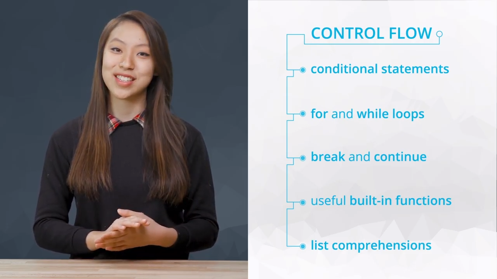
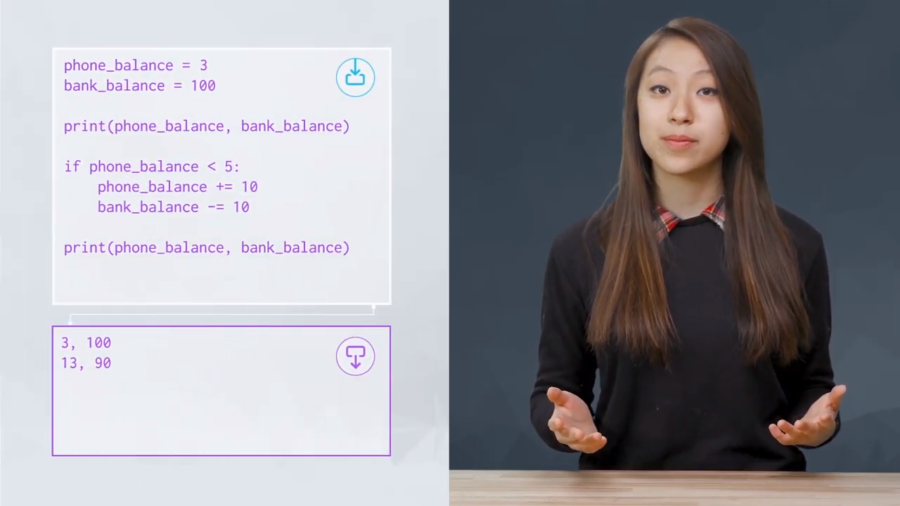
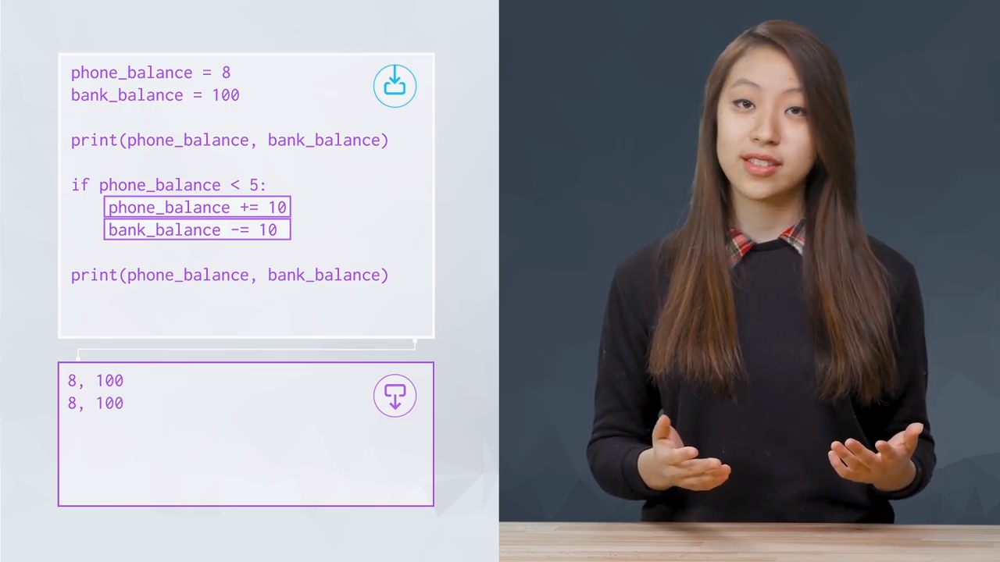
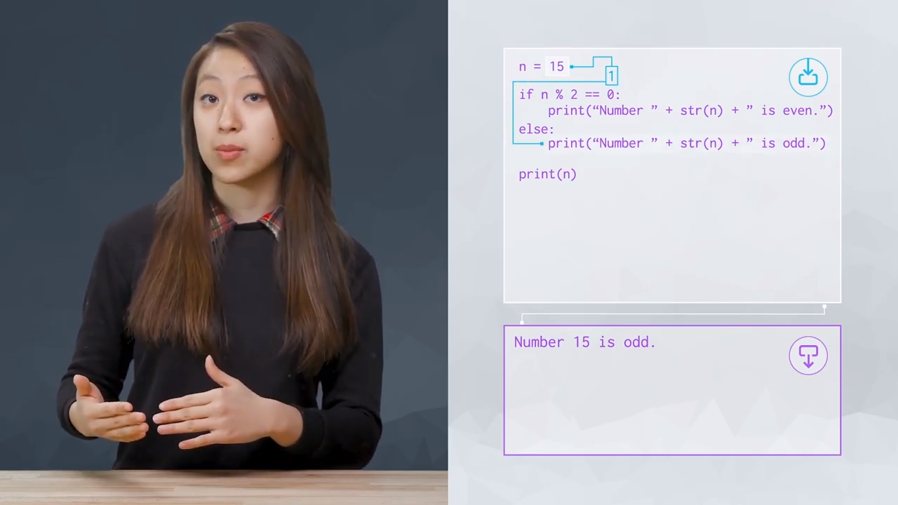
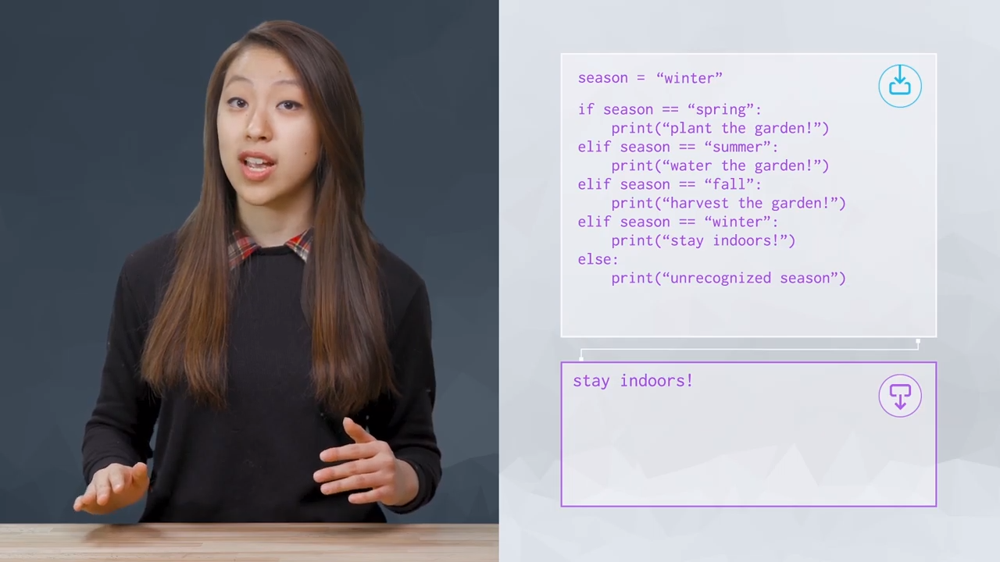
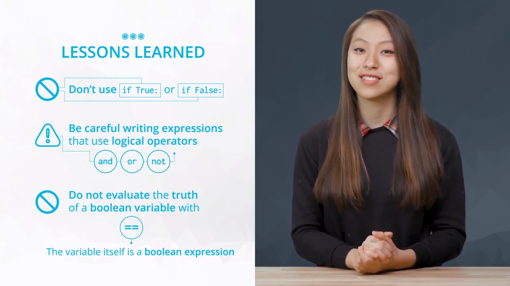
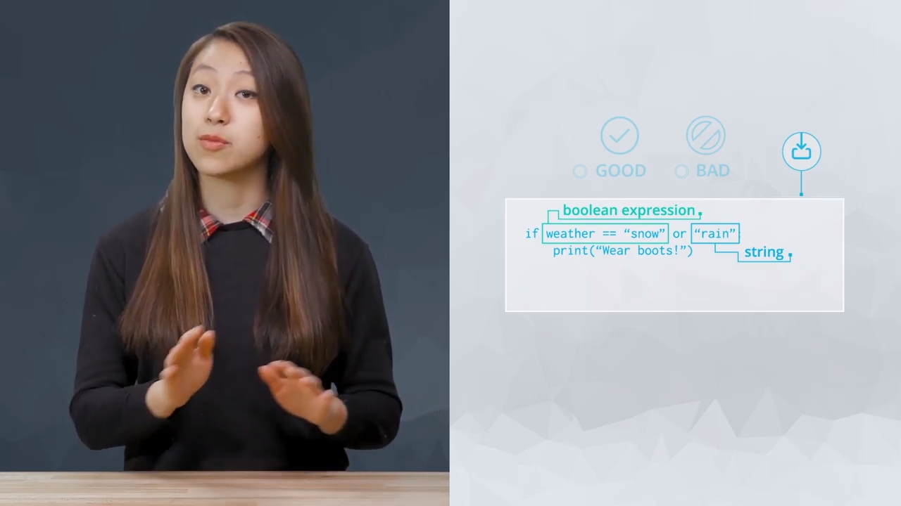
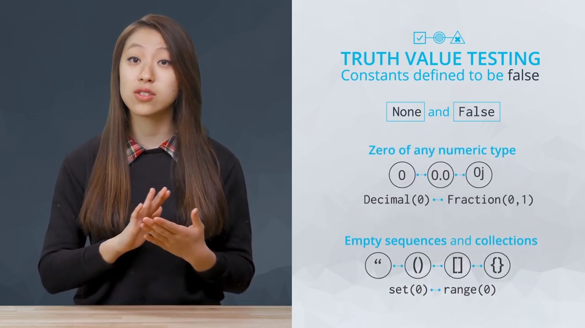

# Control Flow

<details><summary>Outline</summary>

<Dropdown Content>

- [Control Flow](#control-flow)
  - [L4-1. Introduction](#l4-1-introduction)
  - [L4-2. Conditional Statements](#l4-2-conditional-statements)
    - [if](#if)
    - [if...else...](#ifelse)
    - [elif](#elif)
    - [`=` vs. `==`](#vs)
    - [Indentation](#indentation)
      - [Spaces or Tabs?](#spaces-or-tabs)
  - [L4-7. Boolean Expressions for Conditions](#l4-7-boolean-expressions-for-conditions)
    - [Complex Boolean Expressions](#complex-boolean-expressions)
    - [Good and Bad Examples](#good-and-bad-examples)
      - [1. Don't use True or False as conditions](#1-dont-use-true-or-false-as-conditions)
      - [2. Be careful writing expressions that use logical operators](#2-be-careful-writing-expressions-that-use-logical-operators)
      - [3. Don't compare a boolean variable with == True or == False](#3-dont-compare-a-boolean-variable-with--true-or--false)
    - [Truth Value Testing](#truth-value-testing)
  - [L4-10. For Loops](#l4-10-for-loops)
    - [For Loops](#for-loops)
    - [Using the `range()` Function with `for` Loops](#using-the-range-function-with-for-loops)
    - [Creating and Modifying Lists](#creating-and-modifying-lists)
  - [L4-13. Quiz: For Loops](#l4-13-quiz-for-loops)
    - [doc](#doc)
      - [str.replace(old, new[, count])](#strreplaceold-new-count)
    - [Quiz: Tag Counter](#quiz-tag-counter)
    - [doc](#doc-1)
      - [str.startswith(prefix[, start[, end]])](#strstartswithprefix-start-end)
      - [str.endswith(suffix[, start[, end]])](#strendswithsuffix-start-end)
  - [L4-15. Quiz: Match Inputs To Outputs](#l4-15-quiz-match-inputs-to-outputs)
  - [L4-16. Building Dictionaries](#l4-16-building-dictionaries)
    - [Method 1: Using a `for` loop to create a set of counters](#method-1-using-a-for-loop-to-create-a-set-of-counters)
    - [Method 2: Using the `get` method](#method-2-using-the-get-method)
  - [L4-17. Iterating Through Dictionaries with For Loops](#l4-17-iterating-through-dictionaries-with-for-loops)
    - [Iterating Through Dictionaries with `For` Loops](#iterating-through-dictionaries-with-for-loops)
  - [L4-20. While Loops](#l4-20-while-loops)
    - [`While` Loops](#while-loops)
    - [doc](#doc-2)
      - [sum(iterable, /, start=0)](#sumiterable--start0)
  - [L4-21. Practice: While Loops](#l4-21-practice-while-loops)
    - [Practice: Factorials with While Loops](#practice-factorials-with-while-loops)
    - [Practice: Factorials with For Loops](#practice-factorials-with-for-loops)
  - [L4-23. Quiz: While Loops](#l4-23-quiz-while-loops)
    - [Quiz: Nearest Square](#quiz-nearest-square)
  - [L4-25. For Loops vs. While Loops](#l4-25-for-loops-vs-while-loops)
    - [For Loops Vs. While Loops](#for-loops-vs-while-loops)
  - [L4-26. Check for Understanding: For and While Loops](#l4-26-check-for-understanding-for-and-while-loops)
    - [Check for Understanding](#check-for-understanding)
  - [L4-28. Break, Continue](#l4-28-break-continue)
    - [Break, Continue](#break-continue)
  - [L4-29. Quiz: Break, Continue](#l4-29-quiz-break-continue)
    - [Quiz: Break the String](#quiz-break-the-string)
  - [L4-31. Practice: Loops](#l4-31-practice-loops)
    - [Coding Quiz: Check for Prime Numbers](#coding-quiz-check-for-prime-numbers)
    - [for... else](#for-else)
  - [L4-33. Zip and Enumerate](#l4-33-zip-and-enumerate)
    - [Zip](#zip)
    - [Enumerate](#enumerate)
  - [L4-34. Quiz: Zip and Enumerate](#l4-34-quiz-zip-and-enumerate)
    - [Quiz: Zip Coordinates](#quiz-zip-coordinates)
    - [Quiz: Zip Lists to a Dictionary](#quiz-zip-lists-to-a-dictionary)
    - [Quiz: Transpose with Zip](#quiz-transpose-with-zip)
    - [Quiz: Enumerate](#quiz-enumerate)
    - [Diff between `point`, `*point`](#diff-between-point-point)
      - [1. `point`](#1-point)
      - [2. `*point`](#2-point)
      - [3. `*point` with `foramt()`](#3-point-with-foramt)
  - [L4-36. List Comprehensions](#l4-36-list-comprehensions)
    - [Add If](#add-if)
    - [Add Else](#add-else)
  - [L4-37.Quiz: List Comprehensions](#l4-37quiz-list-comprehensions)
    - [Quiz: Extract First Names](#quiz-extract-first-names)
    - [Quiz: Multiples of Three](#quiz-multiples-of-three)
    - [Quiz: Filter Names by Scores](#quiz-filter-names-by-scores)
  - [Vocabulary](#vocabulary)
  - [Reference](#reference)
  - [Further Reading](#further-reading)

</details>

---

## L4-1. Introduction



- Control flow: the sequence in which your code is run.
- we'll learn about several tools in Python:
  - Conditional Statements
  - Boolean Expressions
  - For and While Loops
  - Break and Continue
  - Zip and Enumerate
  - List Comprehensions

## L4-2. Conditional Statements

### if




### if...else...



### elif



- if we have more than two possible cases, we can use eilf
- `elif` short for `else if`

### `=` vs. `==`


- `=`: assign operator
- `==`: comparison operator

### Indentation

- Unlike other programming language using braces to enclose block of code
- In python, we use indentation to enclose block of code.
- This indentation conventionally comes in multiples of four spaces.
- It's important to be strict about following this convention.

#### Spaces or Tabs?

- The [Python Style Guide](https://www.python.org/dev/peps/pep-0008/#tabs-or-spaces) recommends using 4 spaces to indent, rather than using a tab.
- Whichever you use, be aware that "**Python 3 disallows mixing the use of tabs and spaces for indentation.**"

## L4-7. Boolean Expressions for Conditions

### Complex Boolean Expressions

```py
if 18.5 <= weight / height**2 < 25: # height ** 2 compute first
    print("BMI is considered 'normal'")

if is_raining and is_sunny:
    print("Is there a rainbow?")

if (not unsubscribed) and (location == "USA" or location == "CAN"):
    print("send email")
```

- For really complicated conditions you might need to combine some `and`s, `or`s and `not`s together.
- Use parentheses if you need to make the combinations clear.

### Good and Bad Examples



#### 1. Don't use True or False as conditions

- it's useless to use any condition that you know will always evaluate to True or False

    ```py
    # Bad example
    if True:
        print("This indented code will always get run.")

    # Another bad example
    if is_cold or not is_cold:
        print("This indented code will always get run.")
    ```

#### 2. Be careful writing expressions that use logical operators

- Logical operators `and`, `or` and `not` have specific meanings that aren't quite the same as their meanings in plain English.

    ```py
    # Bad example
    if weather == "snow" or "rain":
        print("Wear boots!")

    # Good example
    if weather == "snow" or weather == "rain":
        print("Wear boots!")
    ```



- [Later](#truth-value-testing) we'll discuss what happens when we use non-boolean-type objects in place of booleans.

    ```py
    if "rain": # evaluate result is True
        print("Wear boots!") # Wear boots!
    ```

#### 3. Don't compare a boolean variable with == True or == False

- This comparison isn’t necessary, since the boolean variable itself is a boolean expression.

    ```py
    # Bad example
    if is_cold == True:
        print("The weather is cold!")

    # Good example, discard unnecessary words
    if is_cold:
        print("The weather is cold!")
    ```

- If you want to check whether a boolean is **False**, you can use the `not` operator.

    ```py
    # Bad example
    if is_hot == False:
        print("The weather is cold!")

    # Good example, use "not" operator
    if not is_hot:
        print("The weather is cold!")
    ```

### Truth Value Testing

- By default, the truth value of an object in Python is considered True unless specified as False in the documentation.



- Here are most of the built-in objects that are considered False in Python:
  - constants defined to be false: `None` and `False`
  - zero of any numeric type: `0`, `0.0`, `0j`, `Decimal(0)`, `Fraction(0, 1)`
  - empty sequences and collections: `'""`, `()`, `[]`, `{}`, `set()`, `range(0)`

- example:

    ```py
    errors = 3
    if errors:
        print("You have {} errors to fix!".format(errors))
    else:
        print("No errors to fix!")

    # Output: You have 3 errors to fix!
    ```

## L4-10. For Loops

### For Loops

- A `for` loop is used to "iterate", or do something repeatedly, over an iterable.
- An iterable is an object that can return one of its elements at a time.
  - This can include sequence types, such as **strings**, **lists**, and **tuples**, as well as non-sequence types, such as **dictionaries** and **files**.
- common pattern: the name of list cities is the plural form of city

```py
cities = ['new york city', 'mountain view', 'chicago', 'los angeles']
for city in cities:
    print(city.title())
print("Done!")

'''
output:
New York City
Mountain View
Chicago
Los Angeles
Done!
'''
```

### Using the `range()` Function with `for` Loops

- `range()` is a built-in function used to create an iterable sequence of numbers.
- `range(start=0, stop, step=1)`

```py
print(range(4))                 # range(0, 4)
print(list(range(4)))           # [0, 1, 2, 3]
print(list(range(2, 6)))        # [2, 3, 4, 5]
print(list(range(1, 10, 2)))    # [1, 3, 5, 7, 9]
```

- we adopt range in a list before printing it, because printing just the output of range only shows you a range object

### Creating and Modifying Lists

- we can create a list by appending to a new list at each iteration

    ```py
    # Creating a new list
    cities = ['new york city', 'mountain view', 'chicago', 'los angeles']
    capitalized_cities = []

    for city in cities:
        capitalized_cities.append(city.title())
    ```

- Modifying a list is a bit more involved, and requires the use of the `range()` function.
  - **don't forget to add `range()`**

    ```py
    cities = ['new york city', 'mountain view', 'chicago', 'los angeles']

    for index in range(len(cities)):
        cities[index] = cities[index].title()
    ```

## L4-13. Quiz: For Loops

```py
names = ["Joey Tribbiani", "Monica Geller", "Chandler Bing", "Phoebe Buffay"]
usernames = []

# write your for loop here
for name in names:
    newName = name.replace(" ", "_").lower()
    usernames.append(newName)

print(usernames)

'''
output:
['joey_tribbiani', 'monica_geller', 'chandler_bing', 'phoebe_buffay']
'''
```

### doc

#### str.replace(old, new[, count])

- [str.replace(old, new[, count])](https://docs.python.org/3/library/stdtypes.html#str.replace)

---

- Q2: Let's say instead of creating a new list, we want to modify the names list itself with the changes and write the following code. What would this do?

```py
names = ["Joey Tribbiani", "Monica Geller", "Chandler Bing", "Phoebe Buffay"]

for name in names:
    name = name.lower().replace(" ", "_")

print(names)
```

| answer | option                                                                                  | reason                                                                                                                                                |
| ------ | --------------------------------------------------------------------------------------- | ----------------------------------------------------------------------------------------------------------------------------------------------------- |
|        | Modifies the `names` list so that each name is lowercase and separated by underscores   |                                                                                                                                                       |
| (X)    | Causes a runtime error                                                                  |                                                                                                                                                       |
| (O)    | The printed output for the `names` list will look exactly like it did in the first line | It doesn't modify the contents of the `names` list at all. To modify the list you must operate on the list itself, using `range`, as you saw earlier. |
|        | Deletes the list                                                                        |                                                                                                                                                       |

### Quiz: Tag Counter

Write a `for` loop that iterates over a list of strings, `tokens`, and counts how many of them are XML tags. XML is a data language similar to HTML. You can tell if a string is an [XML tag](https://en.wikipedia.org/wiki/XML) if it begins with a left angle bracket "<" and ends with a right angle bracket ">". Keep track of the number of tags using the variable `count`.

You can assume that the list of strings will not contain empty strings.

```py
tokens = ['<greeting>', 'Hello World!', '</greeting>']
count = 0

# write your for loop here
for token in tokens:
    if (token.startswith('<') and token.endswith('>')):
        count += 1

print(count) # 2
```

- if we don't want to use `str.startswith()` and `str.endswith` method, we can use the method 2.

    ```py
    method 1:
    if (token.startswith('<') and token.endswith('>')):

    method 2:
    if token[0] == '<' and token[-1] == '>':
    ```

### doc

#### str.startswith(prefix[, start[, end]])

- [str.startswith(prefix[, start[, end]])](https://docs.python.org/3/library/stdtypes.html#str.startswith)

#### str.endswith(suffix[, start[, end]])

- [str.endswith(suffix[, start[, end]])](https://docs.python.org/3/library/stdtypes.html#str.endswith)

## L4-15. Quiz: Match Inputs To Outputs

- `range()` from zero to negative number contains nothing

```py
print(list(range(0, -5)))       # []
print(list(range(0, -5, -1)))   # [0, -1, -2, -3, -4]
```

## L4-16. Building Dictionaries

- we have the same `book_title` and `word_counter` in two methods

```py
book_title =  ['great', 'expectations','the', 'adventures', 'of', 'sherlock','holmes','the','great','gasby','hamlet','adventures','of','huckleberry','fin']
word_counter = {}
```

### Method 1: Using a `for` loop to create a set of counters

```py
for word in book_title:
    if word in word_counter:
        word_counter[word] += 1
    else:
        word_counter[word] = 1

print(word_counter)

'''
output:
{'great': 2, 'holmes': 1, 'hamlet': 1, 'huckleberry': 1, 'sherlock': 1, 'adventures': 2, 'gasby': 1, 'expectations': 1, 'fin': 1, 'the': 2, 'of': 2}
'''
```

### Method 2: Using the `get` method

- `word_counter.get(word, 0)`: when there's no word in `word_counter`, the default value is 0

```py
for word in book_title:
    word_counter[word] = word_counter.get(word, 0) + 1

print(word_counter)

'''
output:
{'great': 2, 'holmes': 1, 'hamlet': 1, 'huckleberry': 1, 'sherlock': 1, 'adventures': 2, 'gasby': 1, 'expectations': 1, 'fin': 1, 'the': 2, 'of': 2}
'''
```

## L4-17. Iterating Through Dictionaries with For Loops

### Iterating Through Dictionaries with `For` Loops

- the dictionary `cast` contains these keys and values

```py
cast = {
           "Jerry Seinfeld": "Jerry Seinfeld",
           "Julia Louis-Dreyfus": "Elaine Benes",
           "Jason Alexander": "George Costanza",
           "Michael Richards": "Cosmo Kramer"
       }
```

- Iterating through it in the usual way with a `for` loop would give you just the keys

```py
for key in cast:
    print(key)

'''
output:
Jerry Seinfeld
Julia Louis-Dreyfus
Jason Alexander
Michael Richards
'''
```

- If we wish to iterate through both keys and values, we can use the built-in method `items` like this:

```py
for key, value in cast.items():
    print("Actor: {}    Role: {}".format(key, value))

'''
output:
Actor: Jerry Seinfeld    Role: Jerry Seinfeld
Actor: Julia Louis-Dreyfus    Role: Elaine Benes
Actor: Jason Alexander    Role: George Costanza
Actor: Michael Richards    Role: Cosmo Kramer
'''
```

- `items` is an awesome method that returns tuples of key, value pairs

```py
print(cast.items())

'''
output:
dict_items([('Jerry Seinfeld', 'Jerry Seinfeld'), ('Julia Louis-Dreyfus', 'Elaine Benes'), ('Jason Alexander', 'George Costanza'), ('Michael Richards', 'Cosmo Kramer')])
'''
```

## L4-20. While Loops

### `While` Loops

- `For` loops are an example of "definite iteration" meaning that the loop's body is run a predefined number of times.
- "indefinite iteration" which is when a loop repeats an unknown number of times and ends when some condition is met, which is what happens in a `while` loop.

```py
card_deck = [4, 11, 8, 5, 13, 2, 8, 10]
hand = []

# adds the last element of the card_deck list to the hand list
# until the values in hand add up to 17 or more
while sum(hand)  < 17:
    hand.append(card_deck.pop())
    print(sum(hand))

print(hand)

'''
output:
10
18
[10, 8]
'''
```

- The indented body of the loop should modify at least one variable in the test condition.
  - If the value of the test condition never changes, the result is an infinite loop!

### doc

#### sum(iterable, /, start=0)

- [sum(iterable, /, start=0)](https://docs.python.org/3/library/functions.html#sum)

## L4-21. Practice: While Loops

### Practice: Factorials with While Loops

```py
# number to find the factorial of
number = 6

# start with our product equal to one
product = 1

# track the current number being multiplied
current = 1

# write your while loop here
while (current <= number):
    # multiply the product so far by the current number
    product *= current

    # increment current with each iteration until it reaches number
    current += 1


# print the factorial of number
print(product) # 720
```

### Practice: Factorials with For Loops

```py
# number to find the factorial of
number = 6

# start with our product equal to one
product = 1

# write your for loop here
# for i in range(1, number): # (X) exit at number 6-1
# for i in range(1, number+1): # (△) exit at number 6
for i in range(2, number+1): # (O) there's no need to mutiple by 1
    product *= i


# print the factorial of number
print(product) # 720
```

## L4-23. Quiz: While Loops

### Quiz: Nearest Square

Write a `while` loop that finds the largest square number less than an integer `limit` and stores it in a variable `nearest_square`. A square number is the product of an integer multiplied by itself, for example 36 is a square number because it equals 6*6.

For example, if `limit` is 40, your code should set the `nearest_square` to 36.

- my answer:

    ```py
    limit = 40

    # write your while loop here

    root = 1
    nearest_square = 0
    square = root**2
    while (square < limit):
        nearest_square = square
        root += 1
        square = root**2

    print(nearest_square)
    ```

- solution:

    ```py
    limit = 40

    num = 0 # start from 0
    while (num+1)**2 < limit: ## +1 is the key point
        num += 1
    nearest_square = num**2

    print(nearest_square)
    ```

## L4-25. For Loops vs. While Loops

### For Loops Vs. While Loops

- `for` loops are ideal when the **number of iterations is known or finite.**

    ```py
    # when we
    # have an iterable collection (list, string, set, tuple, dictionary)
    for name in names:

    # when we want to
    # iterate through a loop for a definite number of times, using range()
    for i in range(5):
    ```

- `while` loops are ideal when **the iterations need to continue until a condition is met.**

    ```py
    # when we want to
    # use comparison operators
    while count <= 100:

    # When you want to
    # loop based on receiving specific user input.
    while user_input == 'y':
    ```

- we need to make sure the while loop has:
  1. a condition expression that will be assessed and when met, will allow you to exit the loop
  2. make sure the loop is advancing
  3. the value of the condition variables is changing with each iteration of the loop.

## L4-26. Check for Understanding: For and While Loops

### Check for Understanding

- Q1: There are certain requirements you want to consider adding into a `while` loop. Which of these requirements must be met? (Select all that apply)

    | answer | option                                                          | reason |
    | ------ | --------------------------------------------------------------- | ------ |
    | (O)    | The condition for exiting the while loop should be included     |        |
    | (O)    | Check if the iteration condition is met                         |        |
    | (O)    | Body of the loop should change the value of condition variables |        |

- Q2: Question: What type of loop should we use?

    You need to write a loop that takes the numbers in a given list named num_list:

    ```py
    num_list = [422, 136, 524, 85, 96, 719, 85, 92, 10, 17, 312, 542, 87, 23, 86, 191, 116, 35, 173, 45, 149, 59, 84, 69, 113, 166]
    ```

    Your code should add up the odd numbers in the list, but only up to the first 5 odd numbers together. If there are more than 5 odd numbers, you should stop at the fifth. If there are fewer than 5 odd numbers, add all of the odd numbers.

- method 1: for loop

    ```py
    num_list = [422, 136, 524, 85, 96, 719, 85, 92, 10, 17, 312, 542, 87, 23, 86, 191, 116, 35, 173, 45, 149, 59, 84, 69, 113, 166]
    odd_list = []
    result_list = []

    for num in num_list:
        if num % 2 == 1:
            odd_list.append(num)

    result_list = odd_list[:5]

    print(result_list)
    ```

- method 2: while loop

    ```py
    num_list = [422, 136, 524, 85, 96, 719, 85, 92, 10, 17, 312, 542, 87, 23, 86, 191, 116, 35, 173, 45, 149, 59, 84, 69, 113, 166]
    odd_count = 0
    index = 0
    result_list = []

    while ((odd_count < 5) and (index < len(num_list))):
        if num_list[index] % 2 == 1:
            result_list.append(num_list[index])
            odd_count += 1

        index += 1

    print(result_list) # [85, 719, 85, 17, 87]
    ```

## L4-28. Break, Continue

### Break, Continue

Sometimes we need more control over when a loop should end, or skip an iteration. In these cases, we use the `break` and `continue` keywords, which can be used in both `for` and `while` loops.

- `break` terminates a loop
- `continue` skips one iteration of a loop

```py
manifest = [("bananas", 15), ("mattresses", 24), ("dog kennels", 42), ("machine", 120), ("cheeses", 5)]

# the code breaks the loop when weight exceeds or reaches the limit
print("my solution")
weight = 0
items = []
for cargo_name, cargo_weight in manifest:
    if weight >= 100: # don't forget equal to
        print("  the cargo is full")
        break

    elif cargo_weight + weight > 100:
        print("  skipping: {}".format(cargo_name))
        continue

    else:
        print("  adding: {}".format(cargo_name))
        weight += cargo_weight
        items.append(cargo_name)

print("\nFinal Weight: {}".format(weight))
print("Final Items: {}".format(items))

'''
output:
my solution
  adding: bananas
  adding: mattresses
  adding: dog kennels
  skipping: machine
  adding: cheeses

Final Weight: 86
Final Items: ['bananas', 'mattresses', 'dog kennels', 'cheeses']
'''
```

## L4-29. Quiz: Break, Continue

### Quiz: Break the String

Write a loop with a `break` statement to create a string, `news_ticker`, that is exactly 140 characters long. You should create the news ticker by adding headlines from the `headlines` list, inserting a space in between each headline. If necessary, truncate the last headline in the middle so that `news_ticker` is exactly 140 characters long.

Remember that `break` works in both `for` and `while` loops. Use whichever loop seems most appropriate. Consider adding `print` statements to your code to help you resolve bugs.

- my solution:
  - make sure the length of `news_ticker` never more than 140

    ```py
    # HINT: modify the headlines list to verify your loop works with different inputs
    headlines = ["Local Bear Eaten by Man",
                "Legislature Announces New Laws",
                "Peasant Discovers Violence Inherent in System",
                "Cat Rescues Fireman Stuck in Tree",
                "Brave Knight Runs Away",
                "Papperbok Review: Totally Triffic"]

    news_ticker = ""
    # write your loop here

    for headline in headlines:
        if (len(news_ticker) == 140):
            break

        elif (len(news_ticker) + len(headline) >= 140):
            news_ticker += headline[:140-len(news_ticker)]
            break

        else:
            news_ticker += headline + " "

    print(news_ticker)
    print(len(news_ticker))

    '''
    output:
    Local Bear Eaten by Man Legislature Announces New Laws Peasant Discovers Violence Inherent in System Cat Rescues Fireman Stuck in Tree Brave
    140
    '''
    ```

- answer:
  - concatenate first, then truncate it

    ```py
    headlines = ["Local Bear Eaten by Man",
                "Legislature Announces New Laws",
                "Peasant Discovers Violence Inherent in System",
                "Cat Rescues Fireman Stuck in Tree",
                "Brave Knight Runs Away",
                "Papperbok Review: Totally Triffic"]

    news_ticker = ""
    for headline in headlines:
        news_ticker += headline + " "
        if len(news_ticker) >= 140:
            news_ticker = news_ticker[:140]
            break

    print(news_ticker)
    print(len(news_ticker))

    '''
    output:
    Local Bear Eaten by Man Legislature Announces New Laws Peasant Discovers Violence Inherent in System Cat Rescues Fireman Stuck in Tree Brave
    140
    '''
    ```

## L4-31. Practice: Loops

### Coding Quiz: Check for Prime Numbers

Prime numbers are whole numbers that have only two factors: 1 and the number itself. The first few prime numbers are 2, 3, 5, 7.

For instance, 6 has four factors: 1, 2, 3, 6.

```
1 X 6 = 6
2 X 3 = 6
```

So we know 6 is not a prime number.

In the following coding environment, write code to check if the numbers provided in the list `check_prime` are prime numbers.

- If the numbers are prime, the code should print "[number] is a prime number."
- If the number is NOT a prime number, it should print "[number] is not a prime number", and a factor of that number, other than 1 and the number itself: "[factor] is a factor of [number]".

- **Example output:**

    ```py
    7 IS a prime number
    26 is NOT a prime number, because 2 is a factor of 26
    ```

- my solution:
  - the optimal range is from 2 to `sqrt(number)` or `2 <= x <= sqrt(number)`
  - `number**(1/2)` means `sqrt(number)`
  - `int()`: cut the number after decimal point(**not round off**)

    ```py
    print(int(1.6))  #  1
    print(int(-1.6)) # -1
    ```

  - if `number` is 11, `int(number/2)` is 5, thus we have to add 1

    ```py
    ## Your code should check if each number in the list is a prime number
    check_prime = [26, 39, 51, 53, 57, 79, 85]

    ## write your code here
    ## HINT: You can use the modulo operator to find a factor

    for number in check_prime:
        for i in range(2, int(number**(1/2)) + 1):
            if (number%i == 0):
                factor = i
                print("{} is NOT a prime number, because {} is a factor of {}".format(number, factor, number))
                break

        else: # we can use for...else clause to reduce the use of flags
            print("{} IS a prime number".format(number))

    '''
    output:
    26 is NOT a prime number, because 2 is a factor of 26
    39 is NOT a prime number, because 3 is a factor of 39
    51 is NOT a prime number, because 3 is a factor of 51
    53 IS a prime number
    57 is NOT a prime number, because 3 is a factor of 57
    79 IS a prime number
    85 is NOT a prime number, because 5 is a factor of 85
    '''
    ```

### for... else

- purpose: reduce the use of unnecessary flag
- before:

    ```py
    nums = [60, 70, 30, 110, 90]
    found = False # the flag that can remove
    for n in nums:
        if n > 100:
            found = True # the flag that can remove
            print "There is a number bigger than 100"
            break

    if not found: # the expression that can remove
        print "Not found!"
    ```

- after:

    ```py
    nums = [60, 70, 30, 110, 90]
    for n in nums:
        if n > 100:
            print "There is a number bigger than 100"
            break
    else:
        print "Not found!"
    ```

- ref: [[Python] Loop 配合 else 的妙用](https://note.pcwu.net/2017/02/26/python-loop-else/)

## L4-33. Zip and Enumerate

- `zip` and `enumerate` are useful built-in functions that can come in handy when dealing with loops.

### Zip

- `zip` returns an iterator that combines multiple iterables into one sequence of **tuples**.
- Each tuple contains the elements in that position from all the iterables.

    ```py
    print(zip(['a', 'b', 'c'], [1, 2, 3])) # <zip object at 0x10b8a9dc8>

    print(list(zip(['a', 'b', 'c'], [1, 2, 3]))) # [('a', 1), ('b', 2), ('c', 3)]
    ```

  - Like we did for `range()` we need to convert it to a list or iterate through it with a loop to see the elements.
- we could **unpack** each tuple in a `for` loop

    ```py
    letters = ['a', 'b', 'c']
    nums = [1, 2, 3]

    for letter, num in zip(letters, nums):
        print("{}: {}".format(letter, num))

    '''
    output:
    a: 1
    b: 2
    c: 3
    '''
    ```

- In addition to zipping two lists together, you can also **unzip** a list into tuples using an **asterisk**.

    ```py
    some_list = [('a', 1), ('b', 2), ('c', 3)]
    letters, nums = zip(*some_list)

    print(letters)  # ('a', 'b', 'c')
    print(nums)     # (1, 2, 3)
    ```

### Enumerate

- `enumerate` is a built in function that returns an iterator of tuples containing **indices** and values of a list.
- We'll often use this when you want the index along with each element of an iterable in a loop.

---

- without enumerate:

    ```py
    letters = ['a', 'b', 'c', 'd', 'e']

    for i, letter in zip(range(len(letters)), letters):
        print(i, letter)
    ```

- with enumerate:

    ```py
    letters = ['a', 'b', 'c', 'd', 'e']
    for i, letter in enumerate(letters):
        print(i, letter)

    '''
    output:
    0 a
    1 b
    2 c
    3 d
    4 e
    '''
    ```

## L4-34. Quiz: Zip and Enumerate

### Quiz: Zip Coordinates

Use `zip` to write a for loop that creates a string specifying the label and coordinates of each point and appends it to the list `points`. Each string should be formatted as `label: x, y`, z. For example, the string for the first coordinate should be `F: 23, 677, 4`.

- In the example below, `label, x, y, z` equals to `*point`
  - the tuple was unpacked using `*` in the format method. This can help making code cleaner!

    ```py
    x_coord = [23, 53, 2, -12, 95, 103, 14, -5]
    y_coord = [677, 233, 405, 433, 905, 376, 432, 445]
    z_coord = [4, 16, -6, -42, 3, -6, 23, -1]
    labels = ["F", "J", "A", "Q", "Y", "B", "W", "X"]

    points = []
    # write your for loop here

    for point in zip(labels, x_coord, y_coord, z_coord):
        # label, x, y, z = point
        # points.append("{}: {}, {}, {}".format(label, x, y, z))
        points.append("{}: {}, {}, {}".format(*point))

    for point in points:
        print(point)

    '''
    output:
    F: 23, 677, 4
    J: 53, 233, 16
    A: 2, 405, -6
    Q: -12, 433, -42
    Y: 95, 905, 3
    B: 103, 376, -6
    W: 14, 432, 23
    X: -5, 445, -1
    '''
    ```

### Quiz: Zip Lists to a Dictionary

Use `zip` to create a dictionary `cast` that uses `names` as keys and `heights` as values.

- my solution:

    ```py
    cast_names = ["Barney", "Robin", "Ted", "Lily", "Marshall"]
    cast_heights = [72, 68, 72, 66, 76]

    cast = dict()

    for cast_name, cast_height in zip(cast_names, cast_heights):
        cast[cast_name] = cast_height

    print(cast)

    '''
    output:
    {'Barney': 72, 'Robin': 68, 'Ted': 72, 'Lily': 66, 'Marshall': 76}
    '''
    ```

- answer:

    ```py
    cast_names = ["Barney", "Robin", "Ted", "Lily", "Marshall"]
    cast_heights = [72, 68, 72, 66, 76]

    cast = dict(zip(cast_names, cast_heights))
    print(cast)

    '''
    output:
    {'Barney': 72, 'Robin': 68, 'Ted': 72, 'Lily': 66, 'Marshall': 76}
    '''
    ```

- The order of elements in this output may vary since dictionaries are unordered.

### Quiz: Transpose with Zip

Use `zip` to transpose `data` from a 4-by-3 matrix to a 3-by-4 matrix. There's actually a cool trick for this! Feel free to look at the solutions if you can't figure it out.

- my solution:

    ```py
    data = ((0, 1, 2), (3, 4, 5), (6, 7, 8), (9, 10, 11))

    data_transpose = tuple()

    # for a, b, c, d in zip(data[0], data[1], data[2], data[3]):
    #     data_transpose += (a, b, c, d,)

    for x in zip(*data):
        data_transpose += (x, )

    print(data_transpose)

    '''
    output:
    ((0, 3, 6, 9), (1, 4, 7, 10), (2, 5, 8, 11))
    '''
    ```

- answer:

    ```py
    data = ((0, 1, 2), (3, 4, 5), (6, 7, 8), (9, 10, 11))

    data_transpose = tuple(zip(*data))
    print(data_transpose)

    '''
    output:
    ((0, 3, 6, 9), (1, 4, 7, 10), (2, 5, 8, 11))
    '''
    ```

### Quiz: Enumerate

Use `enumerate` to modify the `cast` list so that each element contains the name followed by the character's corresponding height. For example, the first element of `cast` should change from `"Barney Stinson"` to `"Barney Stinson 72"`.

```py
cast = ["Barney Stinson", "Robin Scherbatsky", "Ted Mosby", "Lily Aldrin", "Marshall Eriksen"]
heights = [72, 68, 72, 66, 76]

# write your for loop here
for index, name in enumerate(cast):
    cast[index] = "{} {}".format(name, heights[index])

print(cast)

'''
output:
['Barney Stinson 72', 'Robin Scherbatsky 68', 'Ted Mosby 72', 'Lily Aldrin 66', 'Marshall Eriksen 76']
'''
```

- if we don't want to use `.format()` method, we can use `+=` operator alternatively, but remember to convert the type to `str`
- wrong:

    ```py
    # hide cast and heights variable
    for index, name in enumerate(cast):
        cast[index] += name + " " + heights[index] # TypeError: Can't convert 'int' object to str implicitly

    print(cast)
    ```

- right:

    ```py
    # hide cast and heights variable
    for index, name in enumerate(cast):
        cast[index] += name + " " + str(heights[index])

    print(cast)
    ```

### Diff between `point`, `*point`

- In the example below, we have the same variables `x_coord`, `y_coord`, `labels` and `points`

    ```py
    x_coord = [23, 53]
    y_coord = [677, 233]
    labels = ["F", "J"]
    points = []
    ```

#### 1. `point`

- the type of point IS `<class 'tuple'>`
- `point = (labels[0], x_coord[0], y_coord[0])`

    ```py
    for point in zip(labels, x_coord, y_coord):
        print(point)

    '''
    output:
    ('F', 23, 677)
    ('J', 53, 233)
    '''
    ```

#### 2. `*point`

- the asterisk(`*`) here is used for **unpacking** the tuple `point`
- the type of *point is **NOT** `<class 'tuple'>`
- `*point = labels[0], x_coord[0], y_coord[0]`

    ```py
    for point in zip(labels, x_coord, y_coord):
        print(*point)

    '''
    output:
    F 23 677
    J 53 233
    '''
    ```

#### 3. `*point` with `foramt()`

```py
for point in zip(labels, x_coord, y_coord):
    print("{}: {} x {}".format(*point))

'''
output:
F: 23 x 677
J: 53 x 233
'''
```

## L4-36. List Comprehensions

- In Python, we can create lists really quickly and concisely with list comprehensions.
- list comprehensions allow us to create a list using a `for` loop in one step.
- list comprehensions are not found in other languages, but are very common in Python

---

- without list comprehensions:

    ```py
    cities = ['new york city', 'mountain view', 'chicago', 'los angeles']

    capitalized_cities = []

    for city in cities:
        capitalized_cities.append(city.title())
    ```

- with list comprehensions:

    ```py
    cities = ['new york city', 'mountain view', 'chicago', 'los angeles']

    capitalized_cities = [city.title() for city in cities]

    print(capitalized_cities) # ['New York City', 'Mountain View', 'Chicago', 'Los Angeles']
    ```

- another example without list comprehensions:

    ```py
    squares = []

    for x in range(9):
        squares.append(x**2)
    ```

### Add If

- another example with list comprehensions:

    ```py
    squares = [x**2 for x in range(9)] # [0, 1, 4, 9, 16, 25, 36, 49, 64]
    ```

- we can also add conditionals to list comprehensions
  - add conditionals before `]`

    ```py
    squares = [x**2 for x in range(9) if x%2 == 0] # [0, 4, 16, 36, 64]
    ```

### Add Else

- if we want to add an `else`, we will get an syntax error like this:

    ```py
    squares = [x**2 for x in range(9) if x%2 == 0 else x+3] # SyntaxError: invalid syntax
    ```

- we have to move the conditionals at the beginning of the list comprehensions, right after the expression (`x**2`):

    ```py
    squares = [x**2 if x%2 == 0 else x+3 for x in range(9)] # [0, 4, 4, 6, 16, 8, 36, 10, 64]
    ```

## L4-37.Quiz: List Comprehensions

### Quiz: Extract First Names

Use a list comprehension to create a new list `first_names` containing just the first `names` in names in lowercase.

- don't forget to add `[0]`

```py
names = ["Rick Sanchez", "Morty Smith", "Summer Smith", "Jerry Smith", "Beth Smith"]

first_names = [name.lower().split(" ")[0] for name in names]
print(first_names)

'''
output:
['rick', 'morty', 'summer', 'jerry', 'beth']
'''
```

### Quiz: Multiples of Three

Use a list comprehension to create a list `multiples_3` containing the first 20 multiples of 3.

- my solution:

    ```py
    multiples_3 = [x for x in range(1, 61, 1) if x%3 == 0]
    print(multiples_3)

    '''
    output:
    [3, 6, 9, 12, 15, 18, 21, 24, 27, 30, 33, 36, 39, 42, 45, 48, 51, 54, 57, 60]
    '''
    ```

- answer:

    ```py
    multiples_3 = [x * 3 for x in range(1, 21)]
    print(multiples_3)

    '''
    output:
    [3, 6, 9, 12, 15, 18, 21, 24, 27, 30, 33, 36, 39, 42, 45, 48, 51, 54, 57, 60]
    '''
    ```

### Quiz: Filter Names by Scores

Use a list comprehension to create a list of names `passed` that only include those that scored at least 65.

- don't forget to use `.items()` method when use `for...in` loop in dictionaries

```py
scores = {
             "Rick Sanchez": 70,
             "Morty Smith": 35,
             "Summer Smith": 82,
             "Jerry Smith": 23,
             "Beth Smith": 98
          }

passed = [name for name, score in scores.items() if score >= 65]
print(passed)
```

## Vocabulary

1. pay-as-you-go(PAYG) (n.) 現收現付
2. concession ticket (n.) 優惠票
3. succinct (adj.) 簡潔的
4. blackjack dealer (n.) 賭場發牌手
5. manifest (n.) 載貨單
6. hummus (n.) 鷹嘴豆泥
7. kennel (n.) 狗舍
8. start off (phr.) 出發

## Reference

1. [loops - When to use "while" or "for" in Python - Stack Overflow](https://stackoverflow.com/questions/920645/when-to-use-while-or-for-in-python)
2. [WhileLoop - Python Wiki](https://wiki.python.org/moin/WhileLoop)
3. [[Python] Loop 配合 else 的妙用](https://note.pcwu.net/2017/02/26/python-loop-else/)

## Further Reading

1. [Understanding the asterisk(*) of Python - Understanding the Python - Medium](https://medium.com/understand-the-python/understanding-the-asterisk-of-python-8b9daaa4a558)
