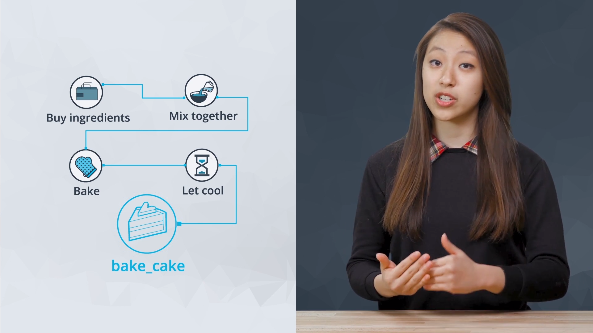

# Functions

- [Functions](#functions)
  - [L5-1. Introduction](#l5-1-introduction)
  - [L5-2. Defining Functions](#l5-2-defining-functions)
    - [Defining Functions](#defining-functions)
      - [Function Header](#function-header)
        - [parameter vs. arguments](#parameter-vs-arguments)
      - [Function Body](#function-body)
    - [Default Arguments](#default-arguments)
  - [L5-6. Variable Scope](#l5-6-variable-scope)
    - [Local Variable](#local-variable)
    - [Global Variable](#global-variable)
    - [More on Variable Scope](#more-on-variable-scope)
  - [L5-7. Quiz: Variable Scope](#l5-7-quiz-variable-scope)
  - [L5-8. Solution: Variable Scope](#l5-8-solution-variable-scope)
  - [L5-9. Check For Understanding: Variable Scope](#l5-9-check-for-understanding-variable-scope)
    - [Check for Understanding](#check-for-understanding)
    - [Q1](#q1)
    - [Q3](#q3)
    - [Q4](#q4)
  - [Vocabulary](#vocabulary)
  - [Reference](#reference)
  - [Further Reading](#further-reading)

---

## L5-1. Introduction

- Previously, we used several of Python's built-in functions
- Here, we were write functions of our own.
- Functions are useful chunks of code that allow us to encapsulate a task
  - **Encapsulation**: a way to carry out a whole series of steps with one simple command
  - 
- Functions are also used to help organize and optimize code

## L5-2. Defining Functions

### Defining Functions

```py
def cylinder_volumes(height, radius):
    pi = 3.14159
    return height * pi * radius ** 2

cylinder_volumes(10, 3) # function call statement
print(cylinder_volumes(10, 3))

'''
output:
282.7431
'''
```

#### Function Header

- defining functions always starts with the `def` keyword and ends with colon(`:`)
- following `def` is the name of the function `cylinder_volumes`
  - this needs one word with no gaps
  - the rules for function names are the same as those for variable names ([snake case](../L2_data_types_and_operators/README.md#snake-case))
- after the function name are parentheses that includes the arguments `height` and `radius`, separated by commas
  - **argument**: values passed in as input to a function

##### parameter vs. arguments

- warning: the class doesn't classify the differences between **(formal) parameters** and **(actual) arguments**, click [here](https://developer.mozilla.org/zh-TW/docs/Glossary/Parameter) for more details
  - A parameter is a named variable passed into a function.
  - Parameter variables are used to import arguments into functions.

```py
def cal_bmi(weight, height): # parameter = weight, height
    return weight / ((height/100)**2)

print(cal_bmi(50, 165)) # argument = 50, 165

'''
output:
18.36547291092746
'''
```

---

#### Function Body

- the body of function is indented after the header and is where the function does its work
  - **local variable**: can only be used within the body of its function
  - [**variable scope**](#l5-6-variable-scope): determines which variables you have access to
- the body of function will often include `return` keyword, it's used to give back an output value when the function is called
- Rather than returning the value as it is calculated, an alternative technique would be to calculate the value earlier and then store it in a variable
  - before

    ```py
    return height * pi * radius ** 2
    ```

  - after

    ```py
    volume = height * pi * radius ** 2
    return volume
    ```


- functions like machines that take input (or arguments) and process them into ouput (or return values)

```py
return_value = print("I wish to register a complaint.")

print("Output: ", return_value)

'''
output:
I wish to register a complaint.
Output:  None
'''
```

- This is a good image but it's incomplete
  - cuz some functions like `print()` don't return anything at all
  - `print()` displays text on the output window but don't return anything
  - `None` is when a function will return by default if it doesn't explicitly return anything else
- diff between `print()` and `return`
  - `print()` provides output to the console while `return` provides the value

- It's not necessary that every function has a return statement

    ```py
    def print_greeting():
        print('Hello World!')
    ```

### Default Arguments

```py
def cylinder_volumes(height, radius = 5):
    pi = 3.14159
    return height * pi * radius ** 2

print(cylinder_volumes(10, 5))  # 785.3975
print(cylinder_volumes(10))     # 785.3975
```

- default arguments allow functions to use default values when those arguments are omitted
- it's helpful because it can make code more concise in scenarios where there's common value we can use for a variable

```py
print(cylinder_volumes(10, 7)) # 1539.3791
```

- arguments are still customizable, we are **overriding** the default value in the example below:
  - notice: we're passing values to our arguments by **position**
- there're two way to pass values
  1. by position

        ```py
        print(cylinder_volumes(10, 7)) # by position
        ```

  2. by name

        ```py
        print(cylinder_volumes(height = 10, radius = 7)) # by name

        print(cylinder_volumes(radius = 7, height = 10)) # it's also acceptable
        ```

## L5-6. Variable Scope

- **variable scope**: the parts of program that a variable can be referenced, or used from

### Local Variable

- if a variable is created inside function, it can only be used within that function

    ```py
    def show_number():
        number = 10
        print(number) # 10

    show_number()
    print(number) # NameError: name 'number' is not defined
    ```

### Global Variable

- alternatively, we might have a variable defined outside of functions

    ```py
    number = 10

    def show_number():
        print(number) # 10

    show_number()
    print(number) # 10
    ```

- the value of a global variable can **NOT be moditfied** inside the function, see [L5-7. Quiz: Variable Scope](#l5-7-quiz-variable-scope) for the details

### More on Variable Scope

- reusing names for objects is OK as long as you keep them in separate scope
- **good practice**: define variables in the smallest scope they will be needed in

## L5-7. Quiz: Variable Scope

Read through this code snippet:

```py
egg_count = 0

def buy_eggs():
    egg_count += 12 # purchase a dozen eggs

buy_eggs()
```

What is the result of running this code? If you aren't sure, try running it on your own computer!

| answer | option                  |
| ------ | ----------------------- |
|        | `egg_count` equals zero |
|        | `egg_count` equals 12   |
| (O)    | An error occurs         |

- output:

    ```py
    UnboundLocalError: local variable 'egg_count' referenced before assignment
    ```

- reason:
  - Python doesn't allow functions to modify variables that are outside the function's scope
  - A better way would be to pass the variable as an argument and reassign it outside the function

## L5-8. Solution: Variable Scope

- If we try to **change** or **reassign** global variable inside function, we get an error
- Python doesn't allow functions to modify variables that aren't in the function's scope
- A better way to write this would be:
  - pass the variable as an argument and reassign it outside the function

    ```py
    egg_count = 0

    def buy_eggs(count):
        return count + 12 # don't modify global variable

    egg_count = buy_eggs(egg_count)
    ```

## L5-9. Check For Understanding: Variable Scope

### Check for Understanding

It is important to understand variable scope, as this often can lead to confusion when writing code that solves complex problems.

### Q1

Use the code below to determine what will print to the console.

```py
str1 = 'Functions are important programming concepts.'

def print_fn():
    str1 = 'Variable scope is an important concept.'
    print(str1)

print_fn()
```

What will happen when we run this code?

| answer | option                                                        | reason                    |
| ------ | ------------------------------------------------------------- | ------------------------- |
| (O)    | It will print 'Variable scope is an important concept.'       | we use the local variable |
|        | It will print 'Functions are important programming concepts.' |                           |
| (X)    | It will give a ValueError.                                    |                           |

### Q3

We made another tweak to the code.

```py
def print_fn():
    str1 = 'Variable scope is an important concept.'
    print(str1)

print_fn(str1)
```

What do you think will happen when we run this code?

| answer | option                                                                            | reason |
| ------ | --------------------------------------------------------------------------------- | ------ |
| (O)    | It will give a TypeError: print_fn() takes 0 positional arguments but 1 was given |        |
| (X)    | It will print 'Variable scope is an important concept.'                           |        |
|        | It will print nothing.                                                            |        |

### Q4

We made a final tweak to the code.

```py
str1 = 'Functions are important programming concepts.'

def print_fn():
    print(str1)

print_fn(str1)
```

Now what do you think will happen?

| answer | option                                                                              | reason |
| ------ | ----------------------------------------------------------------------------------- | ------ |
| (O)    | It still gives a TypeError: print_fn() takes 0 positional arguments but 1 was given |        |
| (X)    | It will print 'Functions are important programming concepts'                        |        |
|        | It will not print anything.                                                         |        |

- conclusion: As long as the function definition did not include any parameters, call function with arguments will give an error

## Vocabulary

1. cylinder (n.) 圓柱體
2. nuance (n.) 細微差別

## Reference

1. [Parameter - MDN Web Docs Glossary: Definitions of Web-related terms | MDN](https://developer.mozilla.org/zh-TW/docs/Glossary/Parameter)

## Further Reading

1. [B. Reserved Words](https://pentangle.net/python/handbook/node52.html)
2. [Python Scope](https://www.w3schools.com/python/python_scope.asp)
